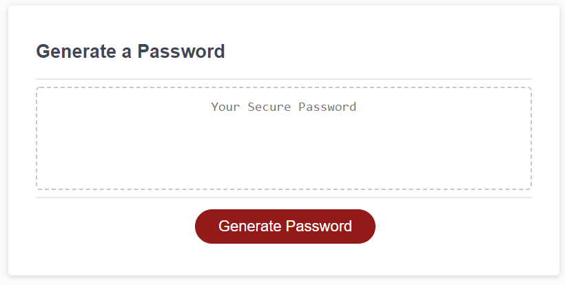

# 03 JavaScript: Password Generator

This is a simple application that generates a random password. The user is able to choose which criteria to include in the generation of the password. The user can choose the length of password, between 8 and 128 characters, lowercase, uppercase, numbers and special characters. The password prints to the screen and the user is able to copy and paste it to their application of choice. 

[Link to project](https://joannatanveer.github.io/passwordgenerator/)
